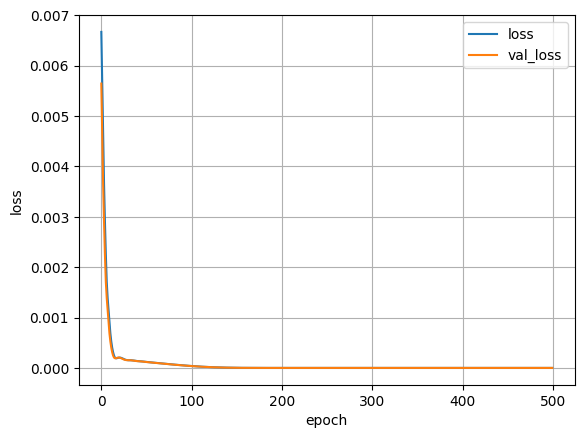
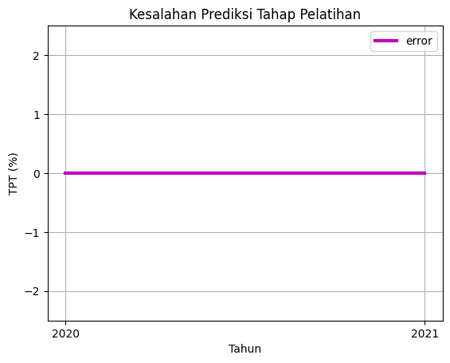

# Predicting the Open Unemployment Rate of Indonesia (Tingkat Pengangguran Terbuka) Using Historical Data From 1987 to 2023 with Deep Learning using Keras

## Table of Contents
- [Predicting the Open Unemployment Rate of Indonesia (Tingkat Pengangguran Terbuka) Using Historical Data From 1987 to 2023 with Deep Learning using Keras](#predicting-the-open-unemployment-rate-of-indonesia-tingkat-pengangguran-terbuka-using-historical-data-from-1987-to-2023-with-deep-learning-using-keras)
  - [Table of Contents](#table-of-contents)
  - [Introduction](#introduction)
  - [Prerequisites](#prerequisites)
    - [Python Version](#python-version)
  - [Setup Instructions](#setup-instructions)
    - [Clone the Repository](#clone-the-repository)
    - [Setting Up Virtual Environment](#setting-up-virtual-environment)
    - [Installing Dependencies](#installing-dependencies)
  - [Usage](#usage)
  - [How It Works and It's Expected Results](#how-it-works-and-its-expected-results)
  - [Contributing](#contributing)
  - [License](#license)

## Introduction
This project is a deep learning model designed to predict the Open Unemployment Rate (TPT) using historical data from 1987 to 2023. The model is built using the Keras library in Python, and the data is loaded from a CSV file. 

The data is first normalized using a custom function, and then split into training and testing sets. The model is a sequential model with three dense layers, using 'relu' activation function and a final layer with 'sigmoid' activation function. The model is trained for 500 epochs, and the mean squared error is used as the loss function.

The model's performance is evaluated using various metrics such as mean squared error (MSE), root mean squared error (RMSE), and mean absolute percentage error (MAPE). The results are visualized using matplotlib to plot the actual vs predicted values and the prediction errors.

Finally, the model is used to predict the Open Unemployment Rate for the years 2022 and 2023. The predicted values are then denormalized and compared with the actual values. The performance of the model on this test data is also evaluated using the same metrics as before.

## Prerequisites

### Python Version
Ensure you have Python version `3.9.13` installed on your system. You can download it from the [official Python website](https://www.python.org/downloads/).

To manage python version you can use [pyenv](https://github.com/pyenv/pyenv) if you're on Linux or [pyenv-win](https://github.com/pyenv-win/pyenv-win) if you're on Windows.

Another thing worth in managing python versions in Windows is that you can install multiple interpreter into the same path and then configure what version to use manually using vscode interpreter setting and set-up a venv from there too. If you are already doing this then it's fine not to use pyenv-win. If you're not then i won't write the tutorial here considering how lengthy it will be.

To check your Python version, run:
``` sh
python --version
```

### Module Requirements
To run this project you need some modules with specific version :
```sh
Tensorflow version : 2.16.1
Keras version : 2.16.0
Numpy version 1.26.4
Matplotlib version 3.8.4
Scikit-learn version 1.4.2
```
It is advised to insstall these specific version as to save you and me some headache. Thankfully i have included an `init.py` file to make it easier to install these modules.

## Setup Instructions

### Clone the Repository
Clone this repository in whenever directory you desire by running the command :
```sh
git clone https://github.com/x1nx3r/prediksi-pengangguran-keras.git
```
### Setting Up Virtual Environment
It is strongly advised to use a virtual environment in this project considering the specific requirements of python and modules versions to save you from the infamous dependency hell. But if you prefer to use global interpreter you can skip this step.

To start setting up your virtual environment you can do :
#### On Windows :
```
python -m venv venv
venv\Scripts\activate
```
#### On Linux :
```
python3 -m venv venv
source venv/bin/activate
```

### Installing Dependencies
With the virtual environment activated, install the required packages using:
```sh
python init.py
```
This will checks for your python interpreter version and whether you have a virtual environment set-up, then installs the required dependency from the `requirements.txt`

## Usage
To run this project you can either use `VSCode` or the vanilla `Jupyter Notebook`
### Using VSCode
If you haven't set-up your VSCode for python development then you have to set it up first to be able to run and debug `Python`

To setup your python development environment in vscode you can refer to  [this guide](https://code.visualstudio.com/docs/languages/python) from the VSCode official docs and [this guide](https://code.visualstudio.com/docs/datascience/jupyter-notebooks) to setup Jupyter Notebook in python.

After having a working python development environment you can then install the `Jupyter Notebook` extension from the Extension Marketplace.

After setting up everything you can just simply open this project folder as a project in VSCode an run the `Prediksi_Pengangguran_2023.ipnyb`

### Using Vanilla Jupyter Notebook
To use the vanilla Jupyter Notebook for this project all you need to do is to run this command in the project directory :
```
jupyter notebook
```

## How It Works and It's Expected Results 
Here you can learn how the project works and see the expected result. What happens in this notebook is largely could be split into two parts. which is the Training Stage and the Prediction Stage. The training stage consist of preparing, normalizing, and training the model with the prepared data (TPT values from the year 1988-2021) (also note that the data point for the year 1995 is interpolated, refer to 1995_year_data_point_interpolation for the process) and the prediction stage consist of utilizing the model to predict known data (TPT values from the year 2022-2023) for it's performance to be measured

Note : Please be aware that results can vary by approx 3%-5% for every execution so treat these results as a reference point only and not an absolute.
### A. Training Stage
- The script starts by importing necessary libraries such as numpy, keras, matplotlib, etc.
- It then defines the path to the data file and checks if the data file exists at the specified path.
- A normalization function is defined to normalize the data.
The data is loaded from the file and normalized.
The data is then split into input (X) and output (Y) for training.
- A Sequential model is defined using Keras with three hidden layers each having 16 neurons and 'relu' activation function. The output layer has 1 neuron with 'sigmoid' activation function.
- The model is compiled with 'mean_squared_error' as the loss function and 'adam' as the optimizer.
- A custom callback is defined to plot the losses after each epoch.
- The model is trained on the data for 500 epochs. This is the result graph of the model training : 
- The model's predictions on the training data are obtained and denormalized.
- The predictions are plotted against the actual values and the error is also plotted. Here are the results of it's error plot 
- Performance metrics such as MSE, RMSE, and MAPE are calculated and printed in which you will get these values
```
mse = 6.548361864962357e-15
rmse = 8.092194921628097e-08
MAPE = 2.991363433963946
Persentase_keberhasilan = 97.00863656603606
```

### B. Prediction Stage
1. The model is used to predict the output for new input data (the TPT value for year 2022-2023)
2. The predictions are denormalized.
3. The predictions are plotted against the actual values and the error is also plotted.
4. Performance metrics such as MSE, RMSE, and MAPE are calculated and printed for the predictions in which you'll get these values
```
mse = 0.4706115752918306
rmse = 0.6860113521595912
MAPE = 11.725411817619984
Persentase_keberhasilan = 88.27458818238001
```

## Contributing
You can freely fork this repository and create a pull request. If you have any problems regarding this project you can contact me thru my email.

## License
MIT License

Copyright (c) 2024 Muhammad Mega Nugraha

Permission is hereby granted, free of charge, to any person obtaining a copy
of this software and associated documentation files (the "Software"), to deal
in the Software without restriction, including without limitation the rights
to use, copy, modify, merge, publish, distribute, sublicense, and/or sell
copies of the Software, and to permit persons to whom the Software is
furnished to do so, subject to the following conditions:

The above copyright notice and this permission notice shall be included in all
copies or substantial portions of the Software.

THE SOFTWARE IS PROVIDED "AS IS", WITHOUT WARRANTY OF ANY KIND, EXPRESS OR
IMPLIED, INCLUDING BUT NOT LIMITED TO THE WARRANTIES OF MERCHANTABILITY,
FITNESS FOR A PARTICULAR PURPOSE AND NONINFRINGEMENT. IN NO EVENT SHALL THE
AUTHORS OR COPYRIGHT HOLDERS BE LIABLE FOR ANY CLAIM, DAMAGES OR OTHER
LIABILITY, WHETHER IN AN ACTION OF CONTRACT, TORT OR OTHERWISE, ARISING FROM,
OUT OF OR IN CONNECTION WITH THE SOFTWARE OR THE USE OR OTHER DEALINGS IN THE
SOFTWARE.

